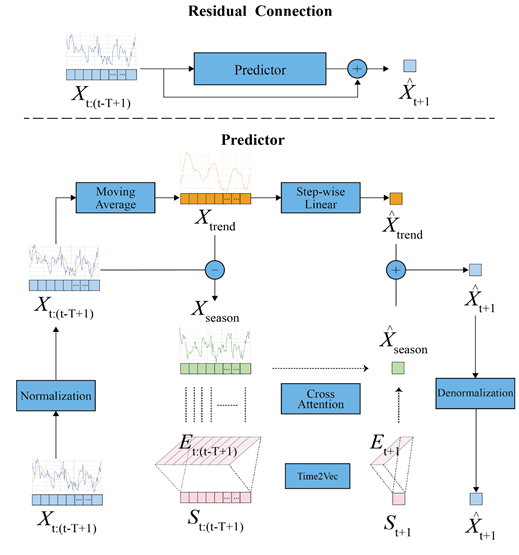

<h1>
RTDLinear: Leverage Residual Time-aware Decomposition Linear for ATM Cash Balance Prediction 
</h1>

# For Reproduction

## 1. Setup
1. Install `pip install -r requirements.txt`
2. Install [Pytorch 2.x ](https://pytorch.org/get-started/locally/) manually with cuda

## 2. Check Results
For convenience, benchmark results are displayed in a jupyter notebook: [click to see results](./notebook/load_metrics.ipynb)

## 3. Directory Structure

Assets Directories
- `./config/{xxx model}.yml`: Configurations for all models
- `./data/`: All the data (raw, processed, info)
- `./log/cluster{n}/{xxx model}/{experiment time}/`: runtime log, metrics, model_configs, checkpoints

Source Code Directories
- `./model/`: Code for models implementations
- `./trainer/`: Code for Model Training and Testing
- `./util/`: Code for other uses

## 3. To Test Trained Neural Models Individually
run `python individual_test.py --model Model` where parameter `Model` can be:
  - `GRU` (for benchmark)
  - `LSTM` (for benchmark)
  - `DLinear` (for benchmark)
  - `TDLinear` (for ablation study)
  - `RTDLinear`

## 4. To Train Neural Models Individually
run `python individual_train.py --model Model` where parameter `Model` can be:
  - `GRU` (for benchmark)
  - `LSTM` (for benchmark)
  - `DLinear` (for benchmark)
  - `TDLinear` (for ablation study)
  - `RTDLinear`

## 4. To Train and Test ML Models
Each ML/Stat model is trained, validated and tested in an independent notebook. 
Results are stored in `./notebooks/` directly.

- see [ARIMA](./notebook/ARIMA_final.ipynb)
- see [MLP](./notebook/MLP_final.ipynb)
- see [SVR](./notebook/SVR_final.ipynb)

## 5. To Run Clustering
- see [clustering_a_s.ipynb](./preprocess/clustering_a_s.ipynb)

## 6. (Not Necessary) To Run Data Preprocessing
- raw data is saved in [ATM cash balance.csv](./data/raw/ATM%20cash%20balance.csv)
- data preprocessing: see [filter.ipynb](./preprocess/filter.ipynb)

<footer>

ATTENTION: This repository is protected by LICENSE AGPL v3.0. Any commercial use in closed source software as well as 
cloud service is not permitted.

Copyright © 2025 Liu Shu. All rights reserved.
</footer>